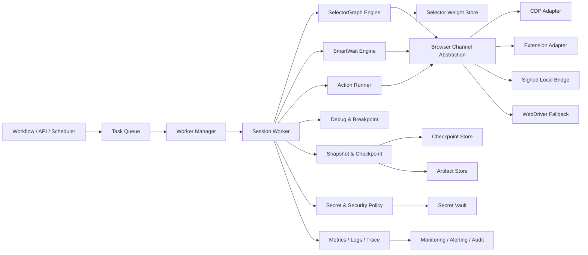
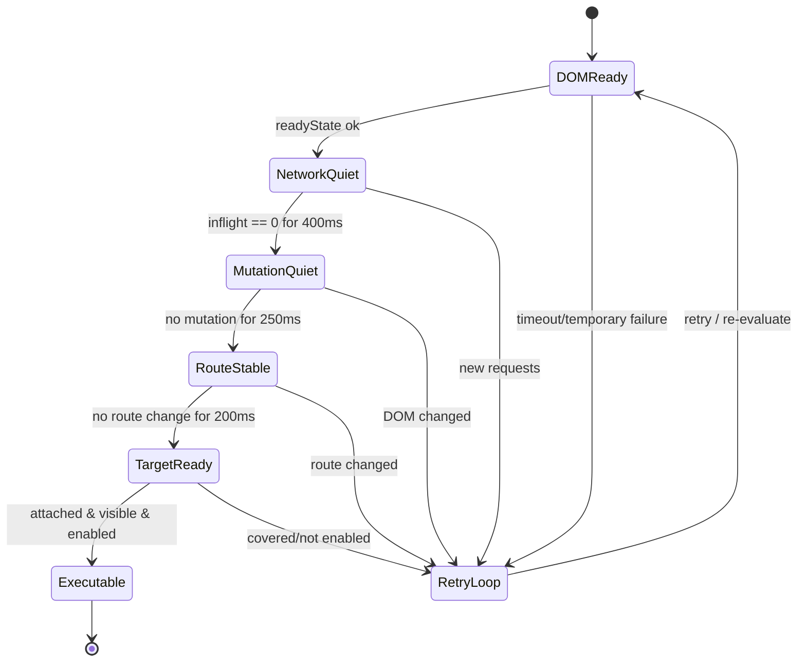

# Web RPA 可实施实现方案

## 实施建议摘要

- 采用**CDP/DevTools 作为主浏览器通道**，浏览器扩展负责页面内 hook 与元素采集，本地桥只负责原生对话框、凭证代理、屏幕与系统能力；不要继续把本地桥当成主 DOM 通道。这个建议来自前序比较中的共同模式：UiPath 偏深度浏览器集成，影刀RPA 明确依赖插件与浏览器对象，astron-rpa 当前源码则把 Web 主链放在浏览器插件与本地桥上。citeturn48view1turn49search0turn49search3turn25view0
- 把元素定位从“单一 path”升级为**SelectorGraph 多信号定位**：结构化属性、文本指纹、相对锚点、frame/shadow 路径栈、视觉回退、历史成功率统一建模；这是对 UiPath Fuzzy/Anchor 思路的工程化落地，也能直接补齐 astron-rpa 当前 `path + checkElement` 主链的短板。citeturn48view0turn48view1turn22view0turn25view0
- 把等待从“元素存在轮询”升级为**多相位状态机**：`DOMReady -> NetworkQuiet -> MutationQuiet -> RouteStable -> TargetReady`；astron-rpa 当前公开源码是 `elementIsReady + 0.3s sleep` 轮询，适合作为底线，不适合作为最终稳态方案。citeturn15view3turn48view2
- 把执行器升级为**可恢复型工作流引擎**：每个原子动作前后都生成异常快照和 checkpoint，配套断点续跑、人工接管、告警、回放与 `.map` 行号映射，复用 astron-rpa 现有 `Flow -> Python -> Debug/CustomBdb` 的代码生成思路。citeturn39view0turn43view0turn46view0turn47view0
- 安全上优先补三件事：**签名化本地桥、凭证句柄化、扩展最小权限**。astron-rpa release notes 已经明确出现凭证管理，而当前源码里本地桥是固定 `127.0.0.1:9082` 调用，这两点决定了一期就必须做协议签名与脱敏。citeturn16search2turn25view0

## 执行摘要

这份方案不是产品宣传稿，而是面向开发团队的**可开工实现方案**。它以之前的比较结论为前提：UiPath 在多目标定位、等待和事件能力上公开能力最完整；影刀RPA 的强项是中国业务场景中的插件驱动、静默运行与低门槛编排；astron-rpa 由 entity["company","科大讯飞","speech ai company"] 开源并托管在 entity["company","GitHub","developer platform"]，源码最透明，当前 Web 实现最容易二开，但也最需要在 SelectorGraph、智能等待、安全桥接和异常恢复上补强。citeturn48view0turn48view1turn49search2turn49search3turn16search2turn22view0turn25view0

本方案的核心落地判断是：**如果目标是“现在就能做，并且后续能演化成私有化内核”，一期最优路线不是复制 UiPath 的全部产品面，而是用“CDP + 扩展 + 签名本地桥 + SelectorGraph + smart_wait + checkpoint”建立稳态骨架**。这条路线既吸收了 UiPath 的多信号 targeting 思路，也保留了影刀RPA/astron-rpa 这类桌面 Agent 架构在静默运行、原生对话框处理和业务编排上的工程优势。citeturn48view0turn48view1turn49search3turn49search12turn49search13turn25view0

本报告中凡是涉及架构、权重、时序、并发、存储、回滚、里程碑等内容，均是**工程设计建议**；凡是引用现有产品能力或 astron-rpa 现状，则尽量直接落到官方文档、帮助中心、release notes 或源码文件。对 UiPath 与影刀RPA 未公开披露的底层实现，我会明确标为“公开资料不足”并给出合理工程推断。citeturn48view1turn49search1turn49search4turn16search2

## 目标与约束

下表分成“需求现状”和“建议落地假设”两列。凡用户未明确给出的项，我保留“未指定”；同时为了让团队可以直接排期，我给出默认实施建议与优先级。

| 项目 | 需求现状 | 建议落地假设 | 优先级 | 说明 |
|---|---|---|---|---|
| 目标平台 | 未指定（上轮为“平台不限”） | **执行端 Windows 优先，服务端 Linux/K8s** | 高 | 兼容现有桌面 Agent 现实；astron-rpa 开源客户端当前 Windows-only，服务端独立后更适合 Linux/K8s |
| 浏览器范围 | 未指定 | **Chromium 优先**：Chrome/Edge/内置浏览器；Firefox 作为兼容二期 | 高 | CDP 最适合做深度观测与无头运行 |
| 并发量 | 未指定 | MVP 单节点 **4-8 并发会话**；一期集群 **20-50 会话** | 高 | 先做进程级隔离，再做节点横向扩展 |
| 容错目标 | 未指定 | P1 流程**任务成功率 ≥ 98%**；可恢复错误自动恢复率 ≥ 80% | 高 | 用于驱动 checkpoint、重试与人工接管设计 |
| 私有化/二次开发 | 未指定 | **必须支持** | 高 | 既然以 astron-rpa 为落地基础，就应把模块边界和协议做成可替换 |
| 无头/静默运行 | 未指定 | **必须支持**：默认静默优先，必要时回退可视模式 | 高 | 兼容服务端调度与办公机非抢占运行 |
| 跨域 iframe | 未指定 | **必须支持** | 高 | 现代后台系统中极常见 |
| Shadow DOM | 未指定 | **必须支持** | 高 | 一期就设计路径栈，但允许先实现 Chromium 场景 |
| 跨域/同源边界 | 未指定 | **遵守浏览器安全边界**；支持合法 iframe/扩展权限内访问，不做“绕过同源”设计 | 高 | 安全优先 |
| OCR/图像/视觉回退 | 未指定 | **一期支持截图/OCR 回退，二期支持视觉哈希与目标区域学习** | 中 | 提升长尾页面可达性 |
| 事务与回滚 | 未指定 | **业务补偿优先**，不做通用 ACID rollback | 中 | Web 自动化天然难做通用回滚，应按业务动作类型建补偿 |
| 分布式调度 | 未指定 | **一期支持任务队列 + Worker 横向扩展** | 中 | 先单租户稳态，再扩多租户 |
| 人工接管 | 未指定 | **必须支持** | 高 | 直接决定目标失败时是否可控 |
| 指标与监控 | 未指定 | **必须支持**：日志、指标、trace、制品统一上报 | 高 | 没有可观测性就没有稳定性治理 |

这些假设里，有四项与前序比较结论强相关：其一，astron-rpa 开源客户端当前仅支持 Windows 10/11，因此执行端 Windows 优先是现实起点；其二，astron-rpa 已经在 release notes 中明确新增 iframe 定位器；其三，影刀RPA 官方帮助中心明确展示了插件驱动、自定义浏览器、静默/不抢占链路；其四，影刀社区已经出现专门补齐 Shadow Root 与兼容性的扩展方案，说明 Shadow DOM 不能再放到“以后再说”。citeturn48view6turn16search2turn49search2turn49search3turn49search7

## 架构总览

建议采用“**六层内核 + 两个共享平面**”架构。六层分别是：**定位层、等待层、执行器、调试/断点/日志、凭证与安全、运维/监控**；两个共享平面分别是**浏览器通道抽象**与**状态/制品持久化**。这样设计的原因，是要把之前比较中暴露出来的三类差异拆开处理：UiPath 的长处在定位与等待；影刀RPA 的长处在插件化与浏览器对象管理；astron-rpa 的长处则在工作流生成、断点和可读源码。citeturn48view0turn48view1turn49search1turn49search3turn39view0turn43view0turn46view0

| 层 | 主要职责 | 关键组件 | 输入 | 输出 |
|---|---|---|---|---|
| 定位层 | 候选生成、评分排序、唯一性判定、frame/shadow 解析、视觉回退入口 | SelectorGraph Engine、Candidate Generator、Scorer、Normalizer | 页面快照、元素模板、历史成功记录 | 最佳目标候选/歧义告警 |
| 等待层 | 多相位页面稳定性判定、元素 readiness、退避策略 | SmartWait Engine、Hook Bundle、Phase Evaluator | DOM/network/mutation/router 信号 | 可执行窗口/等待失败原因 |
| 执行器 | 原子动作执行、会话控制、浏览器对象管理、失败重试 | Action Runner、Session Manager、Channel Adapter | 步骤指令、目标候选、等待结果 | 执行结果、状态变更 |
| 调试/断点/日志 | 单步、断点、`.map` 映射、traceback、录屏/截图 | Debug Service、Breakpoint Manager、Artifact Collector | 运行态事件 | 事件流、制品、调试控制 |
| 凭证与安全 | 秘密管理、桥接认证、脱敏、权限校验 | Secret Vault、Bridge Auth、Masker、Policy Gate | 凭证句柄、桥接请求、扩展消息 | 明文最小暴露、授权结果 |
| 运维/监控 | 指标上报、告警、审计、容量治理 | Metrics Exporter、Alerting、Audit Log、Ops Console | Task/Session/Event/Artifact | 仪表盘、告警、审计线索 |
| 共享平面 | 浏览器能力统一抽象 | CDP Adapter、Extension Adapter、Bridge Adapter、WebDriver Fallback | 浏览器/系统能力 | 统一 API |
| 共享平面 | 状态与制品持久化 | Checkpoint Store、Artifact Store、Config Store、Weight Store | 快照、日志、配置、权重 | 可恢复执行与回放能力 |

建议的组件交互与数据流如下：



从实现顺序上看，最值得坚持的一点是：**浏览器通道抽象必须先做统一接口，再决定每一步具体走 CDP、扩展还是本地桥**。不然很快就会重演 astron-rpa 当前“Web 逻辑散落在 locator、browser_element 和本地桥调用之间”的维护难题。astron-rpa 现有源码里，`LocatorManager`、`WebFactory`、`BrowserElement`、`Flow` 和 `Debug` 的分层已经具备雏形，因此这次重构的重点不是推倒重来，而是补齐统一抽象、状态持久化与安全协议。citeturn22view0turn25view0turn39view0turn43view0turn46view0

## 核心子系统实施方案

本节给出可以直接进入设计评审和编码的核心内核方案。为了让团队可以直接分工，我把“现状动因”“目标结构”“关键数据结构”“算法要点”“实现伪代码”放在同一节中。涉及产品现状的判断，仍然以之前的比较结果为依据：UiPath 公开展示了 Fuzzy/Anchor/WaitState/Trigger 体系；影刀RPA 的帮助中心展示了元素库、插件、静默运行与等待元素存在；astron-rpa 当前公开实现则是 `path + checkElement + elementIsReady`。citeturn48view0turn48view1turn48view2turn49search1turn49search3turn49search4turn22view0turn25view0turn15view3

**元素定位子系统设计**

SelectorGraph 建议定义为“**一个目标对象 + 多组候选信号 + 多轮执行历史**”。核心字段如下：

| 字段 | 类型 | 必填 | 说明 |
|---|---|---:|---|
| `selector_id` | string | 是 | 目标模板唯一 ID |
| `version` | int | 是 | 模板版本，支持增量更新 |
| `app_scope` | object | 是 | 站点、页面类型、业务模块等上下文 |
| `url_pattern` | string | 否 | URL 正则/模板 |
| `page_fingerprint` | object | 是 | 页面指纹，含标题、关键区域 hash、应用标识 |
| `frame_stack` | array | 是 | iframe 路径栈，从外到内 |
| `shadow_stack` | array | 否 | ShadowRoot 路径栈，从外到内 |
| `stable_attrs` | object | 是 | 高稳定属性，如 role、name、aria-label、data-testid |
| `dynamic_attrs` | object | 否 | 易变属性，记录规范化前后的模式 |
| `text_fingerprint` | object | 否 | 文本指纹，含 exact、token、n-gram、language |
| `dom_path` | object | 否 | CSS/XPath/semantic path 的归一化表示 |
| `relative_anchors` | array | 否 | 相对锚点集合 |
| `visual_fallback` | object | 否 | OCR、图像 hash、局部模板图 |
| `weights_profile` | object | 是 | 评分权重配置 |
| `history` | object | 是 | 成功率、最近分数、最近路径漂移、误匹配记录 |
| `policy` | object | 是 | 歧义阈值、退避、是否允许视觉回退、是否允许坐标回退 |

候选生成建议分成五个阶段：

| 阶段 | 输入 | 输出 | 实现要点 |
|---|---|---|---|
| 结构化候选 | `stable_attrs`, `dom_path` | 初选候选集 | 优先从 role、testid、aria-label、name 产生候选 |
| 文本候选 | `text_fingerprint` | 文本命中候选 | 支持 exact、token、模糊文本、近邻标签 |
| 相对候选 | `relative_anchors` | 上下文候选 | 从锚点反推出目标区域 |
| 容器路径候选 | `frame_stack`, `shadow_stack` | 容器内候选 | 先进入 frame/shadow 上下文再选目标 |
| 视觉回退 | `visual_fallback` | 补集候选 | 只在分数不足或结构化歧义时触发 |

推荐评分公式：

\[
Score(c)=
w_a S_{attr}+
w_t S_{text}+
w_r S_{anchor}+
w_p S_{path}+
w_f S_{frame}+
w_s S_{shadow}+
w_v S_{visual}+
w_h B_{history}
-
P_{dynamic}
-
P_{ambiguity}
-
P_{visibility}
\]

默认权重配置建议如下：

| 项 | 默认权重 | 说明 |
|---|---:|---|
| `w_a` 属性分 | 4.0 | 优先使用稳定属性 |
| `w_t` 文本分 | 2.5 | 文案型按钮/标签很重要 |
| `w_r` 锚点分 | 2.5 | 表单、表格、弹窗常用 |
| `w_p` 路径分 | 2.0 | 保留，但不能“一票否决” |
| `w_f` frame 分 | 1.5 | 容器一致性加分 |
| `w_s` shadow 分 | 1.5 | 容器一致性加分 |
| `w_v` 视觉分 | 1.0 | 只作补充 |
| `w_h` 历史加分 | 1.5 | 历史成功路径优先 |
| `P_dynamic` 动态惩罚 | 0-3 | 动态 ID/索引波动越大惩罚越高 |
| `P_ambiguity` 歧义惩罚 | 0-4 | 候选过多且差距过小时惩罚 |
| `P_visibility` 可视性惩罚 | 0-2 | 被遮挡/不可交互时惩罚 |

动态 ID 规范化建议不要“简单忽略”，而要做**模板化归一**：

| 原始模式 | 归一模板 | 说明 |
|---|---|---|
| `btn_123456` | `btn_{NUM}` | 普通递增编号 |
| `react-aria-:r0:` | `react-aria:{TOKEN}` | React Aria/随机 token |
| `ember123` | `ember{NUM}` | Ember 自增 |
| `mui-42` | `mui-{NUM}` | UI 框架动态索引 |
| `row-3-col-8` | `row-{NUM}-col-{NUM}` | 表格式动态索引 |

`frame_stack` 与 `shadow_stack` 建议都设计成**显式路径栈**，而不是拼接成长字符串。推荐结构如下：

| 字段 | 示例 | 说明 |
|---|---|---|
| `frame_stack[0]` | `{match: {name: "contentFrame"}}` | 第一层 iframe |
| `frame_stack[1]` | `{match: {url_pattern: "/detail"}}` | 第二层 iframe |
| `shadow_stack[0]` | `{host: {tag: "x-app-shell"}}` | 第一层 shadow host |
| `shadow_stack[1]` | `{host: {id_template: "dialog-{NUM}"}}` | 第二层 shadow host |

示例 JSON：

```json
{
  "selector_id": "invoice.submit.button",
  "version": 3,
  "app_scope": {
    "site": "erp.example.com",
    "module": "invoice"
  },
  "url_pattern": "/invoice/.*",
  "page_fingerprint": {
    "title_tokens": ["发票", "提交"],
    "body_region_hash": "vh:7c9ab2"
  },
  "frame_stack": [
    { "match": { "name": "mainFrame" } }
  ],
  "shadow_stack": [
    { "host": { "tag": "app-shell" } },
    { "host": { "id_template": "dialog-{NUM}" } }
  ],
  "stable_attrs": {
    "role": "button",
    "aria_label": "提交",
    "data_testid": "submit-invoice"
  },
  "dynamic_attrs": {
    "id_raw": "btn_184392",
    "id_template": "btn_{NUM}"
  },
  "text_fingerprint": {
    "exact": "提交",
    "tokens": ["提交"],
    "ngram": ["提", "交", "提交"]
  },
  "dom_path": {
    "css": "button[data-testid='submit-invoice']",
    "xpath": "//button[contains(., '提交')]"
  },
  "relative_anchors": [
    {
      "anchor_text": "发票金额",
      "relation": "below-right",
      "max_distance_px": 320
    }
  ],
  "visual_fallback": {
    "ocr_text": "提交",
    "image_hash": "phash:ab291f",
    "crop_region": [0.72, 0.81, 0.93, 0.92]
  },
  "weights_profile": {
    "attr": 4.0,
    "text": 2.5,
    "anchor": 2.5,
    "path": 2.0,
    "frame": 1.5,
    "shadow": 1.5,
    "visual": 1.0,
    "history": 1.5
  },
  "policy": {
    "ambiguity_gap_min": 1.2,
    "allow_visual_fallback": true,
    "allow_coordinate_fallback": false
  }
}
```

对应的定位伪代码如下：

```python
def choose_best_candidate(selector_graph, page_ctx):
    candidates = []
    candidates += by_stable_attrs(selector_graph, page_ctx)
    candidates += by_text(selector_graph, page_ctx)
    candidates += by_anchor(selector_graph, page_ctx)
    candidates += by_dom_path(selector_graph, page_ctx)

    if not candidates or is_ambiguous(candidates):
        candidates += by_visual_fallback(selector_graph, page_ctx)

    normalized = deduplicate(candidates)

    for c in normalized:
        c.score = score_candidate(c, selector_graph)

    best = max(normalized, key=lambda x: x.score, default=None)

    if not best or best.score < selector_graph.policy.get("min_score", 6.5):
        raise NeedHumanIntervention("selector not reliable enough")

    return best
```

**智能等待实现方案**

推荐把等待做成**多相位状态机**，每个相位都独立出观测信号与失败原因。默认相位如下：

| 相位 | 浏览器端信号 | 通过条件 | 失败时动作 |
|---|---|---|---|
| `DOMReady` | `document.readyState` | `interactive` 或 `complete` | 短等待并继续轮询 |
| `NetworkQuiet` | `fetch/XHR inflight counter` | `inflight == 0` 且空闲 `>= 400ms` | 继续等待 |
| `MutationQuiet` | `MutationObserver` | 最近 DOM 变更距今 `>= 250ms` | 继续等待 |
| `RouteStable` | `history.pushState/replaceState/popstate` | 最近路由变化距今 `>= 200ms` | 继续等待 |
| `TargetReady` | attached / visible / enabled / not covered | 全部为真 | 失败则进入小退避或重定位 |

浏览器端 hook 建议由**扩展 content script 或 CDP 注入脚本**共同完成。核心实现点如下：

| Hook | 实现方式 | 采集内容 | 备注 |
|---|---|---|---|
| `MutationObserver` | 注入页面脚本 | 最近变更时间、变更次数、热点节点 | 必须做节流 |
| `fetch hook` | 包装 `window.fetch` | 请求开始/结束、状态码、耗时 | 不记录敏感 body |
| `XHR hook` | 包装 `XMLHttpRequest` | 请求开始/结束、状态码、URL 模板 | 与 fetch 统一 inflight 计数 |
| `history hook` | 包装 `pushState/replaceState` | 最近路由变更时间、目标 URL | SPA 必备 |
| `visibility/readiness` | DOM/API 查询 | attached、bounding box、enabled、pointer-events | 用于最终目标确认 |

浏览器侧 hook 伪代码：

```javascript
window.__rpa = {
  inflight: 0,
  lastMutationAt: Date.now(),
  lastRouteAt: Date.now()
};

const rawFetch = window.fetch;
window.fetch = async (...args) => {
  window.__rpa.inflight += 1;
  try {
    return await rawFetch(...args);
  } finally {
    window.__rpa.inflight -= 1;
  }
};

const rawOpen = XMLHttpRequest.prototype.open;
const rawSend = XMLHttpRequest.prototype.send;
XMLHttpRequest.prototype.send = function(...args) {
  window.__rpa.inflight += 1;
  this.addEventListener("loadend", () => window.__rpa.inflight -= 1, { once: true });
  return rawSend.apply(this, args);
};

new MutationObserver(() => {
  window.__rpa.lastMutationAt = Date.now();
}).observe(document, { subtree: true, childList: true, attributes: true });

for (const k of ["pushState", "replaceState"]) {
  const raw = history[k];
  history[k] = function(...args) {
    window.__rpa.lastRouteAt = Date.now();
    return raw.apply(this, args);
  };
}
window.addEventListener("popstate", () => window.__rpa.lastRouteAt = Date.now());
```

等待状态图建议如下：



退避、超时与重试建议：

| 级别 | 默认值 | 说明 |
|---|---:|---|
| 单相位最小 sleep | 50ms | 减少空转 |
| 退避基线 | 50ms | 从小退避开始 |
| 退避上限 | 300ms | 避免等待过慢 |
| 页面动作总超时 | 12s | 普通后台页面 |
| 重定位次数 | 2 次 | 等待失败后重新定位 |
| SmartWait 重试次数 | 2 次 | 首次失败后可刷新目标状态 |
| 页面级恢复 | 1 次 | 允许一次 reload/context renew |

SmartWait 伪代码：

```python
def smart_wait(target, timeout_ms=12000):
    deadline = now_ms() + timeout_ms
    backoff = 50

    while now_ms() < deadline:
        if not dom_ready():
            sleep(backoff); backoff = min(backoff * 2, 300); continue

        if not network_quiet(idle_ms=400):
            sleep(100); continue

        if not mutation_quiet(idle_ms=250):
            sleep(80); continue

        if not route_stable(idle_ms=200):
            sleep(80); continue

        if target_ready(target):
            return True

        sleep(50)

    raise WaitPhaseTimeout(target)
```

**执行引擎与浏览器通道**

建议对浏览器通道做统一比较，并明确“主通道/辅通道/降级通道”的角色。

| 通道 | 适合场景 | 优点 | 缺点 | 建议角色 |
|---|---|---|---|---|
| CDP / DevTools | Chromium、无头、网络/路由/DOM 观测 | 观测全面、headless 友好、适合 smart_wait | 浏览器限制在 Chromium 系 | **主通道** |
| 浏览器扩展 | 页面内 hook、采集元素、跨 tab、下载/权限协同 | 贴近页面运行时，适合注入 hook 和元素采集 | 需要权限治理；跨浏览器成本高 | **主辅通道** |
| 本地 HTTP 桥 | 原生对话框、文件上传下载、剪贴板、凭证代理 | 可接系统能力，适合非 DOM 操作 | 安全风险高；不适合做主 DOM 通道 | **系统能力通道** |
| WebDriver | Firefox/兼容旧场景/远程 Grid | 通用性高 | 观测维度弱于 CDP；等待粒度相对粗 | **兼容降级通道** |

推荐组合是：**Chromium 场景用“CDP + 扩展”做页面内主链，“签名本地桥”做系统能力补充，“WebDriver”留作兼容降级**。这样做有三个直接收益：第一，CDP 负责页面状态观测与无头执行；第二，扩展负责内容脚本、元素采集和部分浏览器权限；第三，本地桥只承担无法在浏览器上下文里做的动作，从而把攻击面压小。这个组合，实际上就是把前序三家产品的优点拆解重组，而不是复制任何一家。citeturn49search2turn49search3turn25view0

多会话与并发执行模型，建议采用**多进程优先，多线程仅作局部优化，分布式靠任务队列横向扩展**。推荐模型如下：

| 层级 | 推荐模型 | 说明 |
|---|---|---|
| 调度层 | 分布式队列 + Worker | 任务与节点解耦 |
| Worker 层 | 进程池 | 浏览器崩溃互不影响 |
| Session 层 | 1 进程 = 1 高风险会话；低风险同系统可共享 browser process + 多 context | 兼顾隔离与资源利用 |
| 浏览器层 | Chromium browser + isolated context | cookie、storage、tab 隔离 |
| 动作层 | 单线程串行执行；只在数据抓取与非交互动作上并发 | 避免 UI 竞态 |

状态持久化与断点续跑建议按四类状态存储：

| 状态对象 | 存储介质 | 生命周期 | 内容 |
|---|---|---|---|
| `task_state` | PostgreSQL | 长期 | 任务定义、调度状态、最后错误 |
| `session_state` | Redis / PG | 运行期 | 浏览器上下文、cookie 句柄、tab 信息 |
| `checkpoint_state` | PostgreSQL + Object Store | 中长期 | 最近成功原子动作、重试次数、恢复入口 |
| `artifact_state` | Object Store | 中长期 | 截图、DOM 摘要、HAR-lite、录屏、日志片段 |

断点续跑的关键不是“从第 N 行重启”，而是“**从最近一个已提交 checkpoint 恢复，并先执行幂等性检查**”。因此建议每个原子步骤都声明动作语义：

| 动作语义 | 示例 | 恢复策略 |
|---|---|---|
| 只读 | 取文本、抓表格、截图 | 直接重跑 |
| 幂等写 | 设置筛选条件、切换 tab | 重跑前先校验目标状态 |
| 非幂等写 | 提交表单、删除记录、批准流程 | 必须先查业务状态，再决定跳过/补偿/人工接管 |

**异常处理与容错策略**

错误分类建议分八类，并把“是否可自动恢复”做成系统级枚举而不是散落在业务代码里：

| 错误类 | 典型信号 | 自动恢复 | 默认策略 |
|---|---|---:|---|
| `SelectorNotFound` | 候选为空 | 是 | 重定位 -> 视觉回退 -> 人工接管 |
| `SelectorAmbiguous` | 多候选分差小 | 否 | 人工接管或策略升权 |
| `WaitPhaseTimeout` | 某相位超时 | 是 | smart_wait 重试 -> reload/context renew |
| `NetworkFlaky` | 请求失败/波动 | 是 | 指数退避重试 |
| `PageCrashed` | tab/browser crash | 是 | 重建 session -> checkpoint 恢复 |
| `BridgeAuthFailure` | nonce/signature/origin 校验失败 | 否 | 立即终止并告警 |
| `CredentialUnavailable` | 句柄失效/凭证不存在 | 否 | 告警 + 人工处理 |
| `BusinessInvariantViolation` | 状态已变/重复提交风险 | 否 | 跳过/补偿/人工接管 |

重试策略建议按**错误类型 + 动作幂等性 + 当前步骤阶段**联合决定：

| 条件 | 最大重试 | 间隔 | 补充动作 |
|---|---:|---:|---|
| 定位失败 | 2 | 200ms / 500ms | 重跑 SelectorGraph |
| 等待超时 | 2 | 300ms / 800ms | reload 或 renew context |
| 网络波动 | 3 | 300ms / 1s / 2s | 记录最近请求摘要 |
| 页面崩溃 | 1 | 立即 | 重建 session 并从 checkpoint 恢复 |
| 非幂等步骤失败 | 0-1 | 需业务确认 | 先做状态查询 |

事务与回滚建议不要追求通用 ACID，而要做**动作级补偿表**：

| 动作类型 | 风险 | 回滚建议 |
|---|---|---|
| 表单填写未提交 | 低 | 直接丢弃 session |
| 筛选/搜索/切页 | 低 | 直接重放 |
| 文件下载 | 中 | 记录文件 hash 与路径，重复下载时跳过 |
| 上传文件 | 中 | 若平台支持查看当前附件列表，先比对后再决定 |
| 提交审批/删除/付款 | 高 | 一律先查业务状态，再决定跳过/人工接管 |

人工干预与告警流程建议如下：当错误被判定为 `human_required`，系统生成**错误摘要 + 当前截图 + DOM 摘要 + 最近 10 条请求摘要 + SelectorGraph 候选详情 + 当前 checkpoint**，推送到 IM/工单；人工可执行四种操作：**继续重试、手工确认跳过、修改权重/目标、终止任务**。这是把“RPA 出错只能看录像”升级为“可以结构化接管”。astron-rpa 当前已有调试、traceback 和 `.map` 机制，很适合作为这个过程的基础设施。citeturn31view0turn39view0turn43view0turn46view0turn47view0

建议纳入监控的关键指标如下：

| 指标 | 含义 | 目标/用途 |
|---|---|---|
| `selector_hit_rate` | 结构化定位一次命中率 | 评估 SelectorGraph 质量 |
| `candidate_ambiguity_rate` | 候选歧义率 | 发现选择器退化 |
| `wait_phase_latency_p95` | 各等待相位 p95 耗时 | 发现瓶颈页面 |
| `action_retry_rate` | 动作重试率 | 发现脆弱步骤 |
| `session_rebuild_rate` | 会话重建率 | 发现 crash/环境问题 |
| `bridge_auth_fail_rate` | 本地桥认证失败率 | 发现攻击或协议错误 |
| `human_intervention_rate` | 人工接管率 | 评估自动化成熟度 |
| `task_success_rate` | 任务总成功率 | 业务 KPI |
| `artifact_capture_rate` | 错误快照采集成功率 | 保障排障可用性 |
| `mttr` | 平均修复时间 | 运维治理指标 |

**安全与权限实现要点**

本地桥建议改成**签名协议**，至少校验：时间戳、会话 ID、nonce、origin、方法白名单。推荐协议字段：

| Header / 字段 | 用途 |
|---|---|
| `X-RPA-Session` | 会话标识 |
| `X-RPA-Timestamp` | 防重放 |
| `X-RPA-Nonce` | 单次随机数 |
| `X-RPA-Origin` | 绑定浏览器上下文来源 |
| `X-RPA-Signature` | HMAC-SHA256(session_secret, canonical_request) |

校验伪代码：

```python
def verify_bridge_request(req, secret_store, nonce_store):
    session = req.headers["X-RPA-Session"]
    ts = int(req.headers["X-RPA-Timestamp"])
    nonce = req.headers["X-RPA-Nonce"]
    origin = req.headers["X-RPA-Origin"]
    signature = req.headers["X-RPA-Signature"]

    if abs(now_ts() - ts) > 30:
        raise AuthError("timestamp expired")

    if nonce_store.exists(session, nonce):
        raise AuthError("replay detected")

    if not is_allowed_origin(session, origin):
        raise AuthError("origin not allowed")

    canonical = build_canonical_request(req.method, req.path, req.body, ts, nonce, origin)
    expected = hmac_sha256(secret_store.get(session), canonical)

    if not constant_time_equal(signature, expected):
        raise AuthError("bad signature")

    nonce_store.put(session, nonce, ttl=60)
```

凭证存储建议采用**句柄化**而不是流程内明文：工作流里只出现 `credential_ref`，仅在动作执行瞬间解引用；解引用结果只存在于进程内短生命周期内存，不进日志、不进错误摘要、不进 screenshot OCR。推荐层次：

| 层 | 方案 |
|---|---|
| 开发/单机 | OS Keychain / DPAPI / Keyring |
| 私有化生产 | Vault / KMS / 企业密管 |
| 运行期使用 | 句柄解引用到内存，使用后立即擦除 |
| 日志脱敏 | 统一通过 Masker，默认屏蔽账号、手机号、邮箱、token、cookie、卡号 |

扩展权限建议坚持**最小权限原则**。推荐权限策略如下：

| 权限 | 建议 | 备注 |
|---|---|---|
| `scripting` | 允许 | 用于注入 hook |
| `activeTab` | 允许 | 尽量优先于全站权限 |
| `tabs` | 允许 | 管理 tab / context |
| `storage` | 允许 | 保存少量扩展状态 |
| `webNavigation` | 允许 | 用于路由/导航感知 |
| `downloads` | 允许（按需） | 只有下载自动化需要时打开 |
| `<all_urls>` | 慎用 | 优先改为 allowlist |
| 广域 host 权限 | 慎用 | 只给目标业务域名 |

跨站脚本与数据泄露防护建议遵循三条硬规则：第一，**hook 与注入代码必须运行在受控包内，不允许从远端动态拉脚本再 eval**；第二，**错误快照中的 DOM 摘要必须做字段级脱敏与裁剪**；第三，**截图与录屏默认裁剪到任务相关区域，并加密存储**。因为一旦把“调试方便”置于“信息边界”之上，RPA 系统会迅速变成数据泄露放大器。astron-rpa 当前已经具备错误码、traceback、录屏和日志入口，因此越早在这些采集点加入脱敏与策略门禁，收益越大。citeturn31view0turn43view0turn46view0

## astron-rpa 开源落地建议

astron-rpa 当前最值得利用的现有基础包括：定位器管理器、WebFactory、本地桥调用、错误码体系、工作流代码生成、启动器与 Debug/CustomBdb。也就是说，它已经有“定位—执行—调试—日志”的骨架，但还没有形成“SelectorGraph—smart_wait—signed bridge—checkpoint resume”这条现代 Web 内核主链。因此，落地建议应当以**增量改造**而不是重写为主。citeturn22view0turn25view0turn31view0turn39view0turn43view0turn46view0turn47view0

建议任务清单如下：

| 任务 | 涉及模块 | 说明 | 优先级 | 难度 |
|---|---|---|---|---|
| SelectorGraph 核心模块 | 新增 `engine/shared/astronverse-locator/.../selector_graph.py`，并改 `locator.py`/`web_locator.py` | 把 `path` 升级为多信号目标对象；支持 frame/shadow 栈与历史成功率 | 高 | 高 |
| Web 候选生成与评分 | 改 `web_locator.py` | 将 `checkElement` 从单结果改为多候选模式，返回评分输入字段 | 高 | 高 |
| smart_wait 引擎 | 新增 `engine/components/.../smart_wait.py`，改 `browser_element.py` | 用多相位状态机替代纯 `elementIsReady` 轮询 | 高 | 中 |
| 浏览器 hook bundle | 扩展/插件侧新增 `wait_hooks.js` 与消息协议 v2 | 实现 Mutation/XHR/fetch/history hook，并暴露只读状态接口 | 高 | 高 |
| 异常快照/断点续跑 | 新增 `snapshot.py` `checkpoint_store.py`，改 `flow.py` `start.py` `debug.py` | 每个原子步骤前后快照，支持 checkpoint 恢复和人工接管 | 高 | 中 |
| 本地桥签名化 | 改 `astronverse-browser-plugin` 宿主与桥接协议 | 增加 session secret、nonce、origin、签名校验 | 高 | 中 |
| 凭证模块 | 新增 `secret_store.py` 或扩展现有凭证能力 | 流程只保存 `credential_ref`，动作临时解引用 | 高 | 中 |
| 指标与告警 | 新增 `metrics.py` `alerting.py` | 上报定位命中率、等待相位耗时、人工接管率等 | 中 | 中 |
| 视觉回退 | 新增 `visual_fallback.py` | OCR/视觉哈希/局部模板图，作为长尾补充 | 中 | 中 |
| Firefox/WebDriver 兼容 | 新增 `webdriver_adapter.py` | 兼容降级而非主链 | 低 | 中 |

建议优先落地的关键代码点如下。

**SelectorGraph 选择入口：**

```python
class SelectorGraphResolver:
    def resolve(self, selector_graph, page_ctx):
        candidates = self.generate_candidates(selector_graph, page_ctx)
        scored = [self.score(c, selector_graph) for c in candidates]
        best = self.pick_best(scored)
        if not best:
            raise SelectorNotFound()
        return best
```

**在 `browser_element.py` 中统一接入 smart_wait：**

```python
def click(target, session):
    candidate = session.selector_resolver.resolve(target, session.page_ctx)
    session.smart_wait.wait(candidate)
    return session.action_runner.click(candidate)
```

**本地桥签名校验中间件：**

```python
def bridge_middleware(req):
    verify_bridge_request(req, secret_store, nonce_store)
    return dispatch(req)
```

建议的一期改造顺序是：**先做通道抽象与签名桥，再做 SelectorGraph 与 smart_wait，最后做 checkpoint/resume 与指标体系**。原因很简单：桥接协议和通道抽象决定扩展性，SelectorGraph 和 smart_wait 决定稳定性，checkpoint/resume 与指标体系决定可运营性。这个顺序如果反过来，团队会在后续每一轮迭代里被协议兼容和模块边界反复拖慢。astron-rpa 当前已有 release 在持续强化 iframe、浏览器控制与凭证管理，因此按这个顺序接着往前推，最符合它现有演化方向。citeturn16search2turn22view0turn25view0turn31view0turn43view0

## 交付物与里程碑建议

下面给出一套可以直接拿去排期的五里程碑计划。工时按照**3-4 名后端/客户端工程师 + 1 名 QA/自动化测试**粗略估算，单位为**工程小时**，仅用于一级计划，不是合同级承诺。

| 里程碑 | 主要目标 | 主要交付物 | 验收标准 | 估算工时 | 风险点 |
|---|---|---|---|---:|---|
| 通道与协议基线 | 统一 Browser Channel 抽象；本地桥签名化；基本 session manager | `channel_adapter`、签名桥协议、session 生命周期管理 | Chromium 能完成打开页面、注入 hook、原生文件对话框联动；桥接通过 nonce/signature/origin 校验 | 180-240h | 本地桥升级影响现有插件兼容 |
| SelectorGraph 一期 | 完成多信号目标对象、基础候选生成、frame/shadow 栈、评分器 | `selector_graph.py`、权重配置、目标 JSON 格式、捕获器适配 | 20 个典型页面的目标命中率较旧方案提升 ≥ 30%；歧义可结构化上报 | 220-300h | 采集端与执行端模型不一致 |
| SmartWait 与稳态执行 | 完成多相位等待、hook bundle、等待指标 | `smart_wait.py`、hook bundle、等待相位监控 | SPA 页面关键动作成功率显著提升；`WaitPhaseTimeout` 可定位到具体相位 | 220-280h | 浏览器注入与 CSP/站点限制冲突 |
| Checkpoint 与人工接管 | 完成异常快照、checkpoint store、断点续跑、人工审批流 | `snapshot.py`、`checkpoint_store.py`、告警模板、接管 UI/API | 页面 crash、网络抖动、定位失败等场景可恢复；人工可继续/跳过/终止 | 200-260h | 非幂等业务动作的恢复规则复杂 |
| 试点与硬化 | 完成 2-3 个真实业务流程试点，输出运维文档与基准数据 | 试点流程包、SOP、指标面板、压测报告 | 试点任务成功率 ≥ 98%；人工接管率 ≤ 5%；具备上线清单 | 160-220h | 业务系统边角场景暴露新需求 |

建议每个里程碑都定义**强制验收清单**，至少包括：单元测试、协议兼容测试、浏览器版本兼容清单、截图/日志脱敏检查、回放样例、失败样例、运维 Runbook。否则实现再漂亮，也很容易在试点阶段被“可排障性”拖垮。

如果资源更紧，可以压缩成三阶段：**内核骨架 -> 稳定性增强 -> 可运营化**。但不建议把“安全协议”和“异常快照”推到最后，因为这两项越晚做，改动越大，且会污染日志与接口规范。

## 参考与优先资料来源

建议开发团队在实施时按下面的优先顺序查阅资料。由于系统不允许直接输出裸链接，以下来源可通过引用跳转。

| 资料 | 用途 | 优先级 | 备注 |
|---|---|---|---|
| UiPath Fuzzy Search、UI Automation 活动目录、Find Element 文档 citeturn48view0turn48view1turn48view2 | 作为多通道定位、显式等待、事件触发的产品参考系 | 高 | 重点看 Fuzzy、Anchor、Wait、Trigger |
| 影刀RPA 帮助中心：新手 FAQ、获取元素信息(web)、获取已打开的网页对象、自定义浏览器说明、填写输入框(web)、上传/下载对话框 citeturn49search0turn49search1turn49search2turn49search3turn49search4turn49search12turn49search13 | 参考插件化、静默运行、浏览器对象与业务实操模式 | 高 | 重点看插件安装、静默运行与元素库路径 |
| astron-rpa release notes citeturn16search2 | 了解 iframe、凭证管理、浏览器控制等最近演进方向 | 高 | 作为改造方向的佐证 |
| astron-rpa `locator.py`、`web_locator.py`、`browser_element.py` citeturn22view0turn25view0turn15view3 | 理解当前 Web 定位、等待、点击、输入链路 | 高 | 这是 SelectorGraph 与 smart_wait 改造入口 |
| astron-rpa `error.py`、`flow.py`、`start.py`、`debug.py` citeturn31view0turn39view0turn43view0turn46view0turn47view0 | 理解错误码、代码生成、调试器、断点与失败处理 | 高 | 这是 checkpoint/resume 的改造入口 |
| astron-rpa FAQ citeturn48view6 | 了解开源客户端平台边界 | 中 | 当前开源客户端仍是 Windows-only |
| 影刀社区关于 DrissionPage/Shadow Root 的扩展方案 citeturn49search7 | 作为现代前端兼容性的生态侧信号 | 中 | 不是官方规格，作为补充参考 |
| 影刀社区网络监听案例 citeturn49search8 | 作为“请求监听/数据抓取”能力的业务侧参考 | 低 | 更偏方案思路，不是底层实现文档 |

从资料优先级看，真正应该作为“设计输入”的不是泛泛博客，而是三类资料：**UiPath 官方文档用于学习成熟产品怎么暴露能力，影刀RPA 帮助中心用于理解业务工具怎么落地，astron-rpa 源码与 release notes 用于决定你该改哪里、先改什么**。如果团队在某一细节上找不到足够公开资料，建议按本方案的结构先落地最小闭环，并在设计文档中明确标注“公开资料不足，当前为工程推断”。