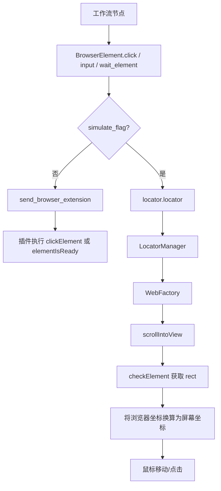
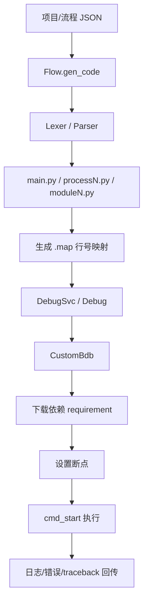
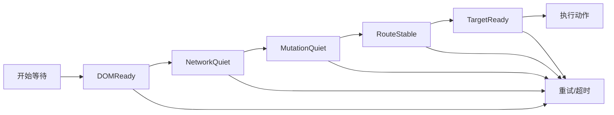

# Web RPA 实现方式深度研究报告

## 执行摘要

基于公开资料检索，我将用户问题中的“影刃RPA”按官方产品名“影刀RPA”处理：公开可检索到的帮助中心、插件安装说明、网页对象与网页元素相关页面，均归属于影刀RPA官方站点与帮助中心，而未检索到“影刃RPA”的对应官方产品资料。因此，下文的对比对象为 UiPath、影刀RPA 与 astron-rpa。citeturn49search0turn49search1turn49search2turn49search3turn49search4

目前主流的 Web RPA，已经明显不是“单一 XPath/CSS + sleep”的模式，而是演进为三层组合：第一层是浏览器深度集成通道，用于拿到高可信的 DOM/浏览器对象；第二层是多通道定位，包括结构化 selector、模糊匹配、相对锚点、文本/图像/OCR/计算机视觉等；第三层是工作流编排、调试器、日志、失败回退和人工接管。UiPath 的公开文档把这种多通道路由暴露得最完整；影刀RPA 的帮助中心更偏“如何用指令”，能明确看出其浏览器插件、元素库和目标点回退；astron-rpa 则直接在源码里展示了“本地桥接 + 浏览器插件 + 轮询等待 + 代码生成 + 调试器”的完整链路。citeturn48view0turn48view1turn48view2turn49search0turn49search1turn49search3turn49search4turn22view0turn25view0turn39view0turn43view0turn46view0turn47view0

如果把“当前 Web RPA 实现成熟度”拆成**定位稳健性、等待智能化、异常恢复、可观测性、二次开发自由度**五项，我的工程判断是：UiPath 在产品成熟度上仍然最强，尤其是多目标定位和等待编排公开能力最完整；影刀RPA 在中文业务场景、插件驱动与低门槛落地上很强，但底层 Web 引擎的公开披露明显少于 UiPath；astron-rpa 的优势是透明、可改、可读，尤其适合二开和私有化，但其公开源码所展示的 Web 实现，目前更接近“可靠的工程骨架”，尚未达到 UiPath 那种以多信号融合与高级等待策略为核心的成熟水平。这个结论中的“最强/更成熟/更适合二开”属于结合公开文档、源码透明度和机制暴露粒度做出的工程推断，而非厂商官方自述。citeturn48view0turn48view1turn48view2turn49search1turn49search3turn49search4turn16search2turn22view0turn25view0turn31view0turn39view0turn43view0turn46view0turn47view0

还需要说明一个证据边界：UiPath 与影刀RPA 都是闭源产品，因此本报告在它们的“Shadow DOM、MutationObserver、XHR/fetch 监控、事务/回滚”等底层实现上，会严格区分“官方明确披露”“可合理推断”和“公开资料未充分披露”；而 astron-rpa 的这类分析，则尽量直接落到 entity["company","GitHub","developer platform"] 仓库源码。citeturn48view0turn48view1turn49search0turn49search1turn49search4turn16search0turn22view0turn25view0

## 研究口径与当前 Web RPA 实现范式

从公开资料看，Web RPA 的实现方式大致可以归纳为四种路线：一是**浏览器内部通道**，也就是浏览器插件、内建浏览器接口或本地桥接服务；二是**结构化元素定位**，把页面元素持久化成某种 selector/path/元素元数据；三是**视觉与文本回退**，当结构化定位不稳定时，退回到文字、图像、OCR、CV 或坐标点击；四是**编排与调试层**，负责等待、断点、重试、日志、依赖分发和失败终止。UiPath 的公开文档最明确地展示了 Fuzzy Search、Anchor、Text、Image、OCR、CV、WaitState、Trigger and Monitor Events 这些能力；影刀RPA 的帮助文档则明确曝光了浏览器插件、网页对象、元素库、捕获新元素、自定义目标点、“运行时不抢占鼠标键盘”等机制；astron-rpa 源码显示其 Web 路径围绕 `path`、浏览器插件、本地 HTTP 桥和 CustomBdb 调试器展开。citeturn48view0turn48view1turn48view2turn49search0turn49search1turn49search2turn49search3turn49search4turn22view0turn25view0turn43view0turn46view0turn47view0

这也解释了为什么“现在的 Web RPA”越来越像一个混合系统，而不是单纯的 Selenium/脚本包装：现代前端大量使用动态 ID、虚拟 DOM、SPA 路由、延迟渲染、嵌套 iframe、文件上传下载对话框，以及在某些场景下需要静默运行、不抢占鼠标键盘。影刀RPA 的官方文档已经直接把“自定义浏览器驱动”“静默运行”“上传/下载对话框处理”列为一等使用场景；astron-rpa 在最新 release 中把 iframe 定位器列为新能力；UiPath 则通过 Wait、Trigger、Fuzzy、Anchor、CV 等活动族群，把“稳定性”拆成多种能力面向用户暴露。citeturn49search2turn49search3turn49search4turn49search12turn49search13turn16search2turn48view0turn48view1turn48view2

一个很有代表性的变化是：等待机制正在从“固定延迟”转向“目标状态驱动”。UiPath 的 `Find Element` 明确支持等待元素出现、可见、激活；影刀RPA 的官方帮助页直接提示“等待元素存在”与固定延迟并列为常规做法；astron-rpa 的源码则把等待具体实现为对浏览器插件 `elementIsReady` 的轮询。这三者的差别，不在有没有“等待”这个功能，而在**等待信号的丰富度**：UiPath 暴露了更多 declarative 能力；影刀RPA 公开页偏“实用指令级”；astron-rpa 的公开实现则更容易看出其当前机制仍以 polling 为主。citeturn48view1turn48view2turn49search4turn15view3

## 关键技术维度逐项比较

### 页面元素选择与定位

UiPath 的公开文档把“定位”设计成多通道系统，而不是单一语法。最明确的证据是 Fuzzy Search：它不是要求精确匹配，而是允许按模式匹配多个属性，从而容忍部分属性变化；同时文档目录把 Anchor Base、Context Aware Anchor、Click Text、Click Image、Click OCR Text、CV Click、CV Get Text 等能力并列展示，说明其对相对定位、文本定位、图像定位和 CV 回退是产品级建模，而不是边缘工具。这种设计对动态 ID、标签文案轻微变化和布局漂移都更友好。需要强调的是，在我本次检索到的公开页面里，UiPath 并没有把 XPath/CSS/ARIA 作为主要、显式的一等建模语言来介绍；它的公开叙事更偏“selector + fuzzy + anchor + image/text/CV”。citeturn48view0turn48view1turn48view2

影刀RPA 的公开帮助中心显示，其 Web 定位主路径是“网页对象 + 元素库/捕获新元素 + 操作目标”，并且在输入框相关页面里明确给出“自定义：手动指定目标点”“等待目标元素存在”“谷歌系浏览器接口输入”等选项。这意味着它明显具备**结构化元素定位**与**坐标/目标点回退**两条链路；再结合插件安装说明与“可被影刀驱动的浏览器列表”，可以合理判断其定位核心依赖浏览器插件/浏览器接口，而不是纯桌面坐标脚本。不过，就本次检索到的公开页而言，我没有看到影刀RPA把 XPath、CSS、ARIA、模糊属性评分、相对锚点算法、Shadow DOM 透传规则等底层机制讲得非常细，因此这部分只能给出“能力侧有迹象，底层细节披露不足”的判断。citeturn49search0turn49search1turn49search2turn49search3turn49search4

astron-rpa 的公开源码最清楚。`LocatorManager` 先按 `PickerDomain` 分发定位器，Web 域会优先走 `web_factory_callback`，同时保留 `web_ie_factory_callback` 作为不同浏览器栈的回退；元素如果以字符串传入，会先解析 JSON，并对 `img` 字段做特殊处理，但在浏览器 Web 主链里真正被用来定位的仍然是 `elementData.path`。`WebFactory.find` 只对 Chromium-like 浏览器对象生效，然后通过本地 `127.0.0.1:9082/browser/transition` 服务先发 `scrollIntoView`，再发 `checkElement`，最后把插件返回的浏览器内坐标转换为屏幕坐标。这个实现最大的优点是清晰、可读、可改；最大的短板是从 Python 可见部分看，尚未形成 UiPath 那种“多属性多策略打分”的定位层。citeturn22view0turn25view0

astron-rpa 在跨容器能力上，最新 release 已经明确提到新增 iframe 定位器，这一点是有正式发布说明支撑的；但我没有在本次检索到的公开源码和 release 片段里看到对 Shadow DOM 的明确实现说明。换句话说，它的 iframe 路径已经从“完全未知”升级到“明确支持”，而 Shadow DOM 至少在公开证据层仍然不够强。citeturn16search2turn25view0

| 维度 | UiPath | 影刀RPA | astron-rpa | 证据 |
|---|---|---|---|---|
| 选择器类型 | 官方公开强调 selector、Fuzzy、Anchor、Text/Image/OCR/CV，多通道最完整 | 官方公开明确有元素库、捕获新元素、自定义目标点；XPath/CSS/ARIA 未见细讲 | 元素 JSON + `path` 为主，`img` 字段可兼容保存，Web 主链以插件 rect 获取为核心 | citeturn48view0turn48view1turn49search1turn49search4turn22view0turn25view0 |
| 定位策略 | 模糊匹配 + 锚点/上下文定位，容忍属性变化 | 捕获元素为主，手工目标点为回退；公开资料未披露评分或模糊算法 | 插件 `checkElement` + `scrollIntoView`，若模拟人工则退回 locator + 鼠标点击 | citeturn48view0turn48view1turn49search4turn15view3turn25view0 |
| 动态元素策略 | Fuzzy Search 明确用于属性会变化的场景 | 公开页能看到等待与目标点回退，但未见动态 ID 正则化等底层说明 | Python 主链未见显式动态 ID 归一化；更多依赖插件侧 path 与 readiness 检查 | citeturn48view0turn49search4turn15view3turn25view0 |
| iframe / Shadow DOM | 本次检索到的公开页未细讲 | 本次检索到的官方页未细讲 | iframe 在 v1.1.6 release 明确支持；Shadow DOM 未见公开证据 | citeturn16search2turn49search1turn49search4turn48view1 |
| 坐标/图像回退 | 明确具备 Text/Image/OCR/CV 族能力 | 明确具备目标点/不抢占鼠标键盘的实用链路 | 支持模拟人工时按屏幕中心点点击；图像信息在元素 JSON 中可保存 | citeturn48view1turn49search3turn49search4turn22view0turn15view3 |

上表里凡是写“未细讲”“未见公开证据”的单元格，都不应理解为“不支持”，而应理解为“本次能找到的公开官方/源码证据不足以下硬结论”。这一点对闭源产品尤其重要。citeturn48view1turn49search0turn49search1turn49search4turn16search2

### 网页智能等待与加载检测

UiPath 的公开等待能力在三者里最成体系。`Find Element` 明确支持等待元素出现、可见、激活；同时文档目录中存在 `WaitState`、`Trigger and Monitor Events`、`Application Event Trigger` 等活动/编码 API 入口。这说明它不仅支持显式等待，而且支持事件型或状态型等待。只是我在本轮检索中没有拿到专门讲 MutationObserver、XHR/fetch hook、SPA 路由监听的官方页，所以不能把这些底层技术细节直接归到“已公开证实”。更准确的说法是：UiPath 在产品能力层把等待抽象得最完整，但底层观测实现并非都在这组公开页中展开。citeturn48view1turn48view2

影刀RPA 的官方帮助页更朴素，重点是“固定等待”和“等待元素存在”。在“填写输入框(web)”页面里，官方直接把“方法一：固定延迟”“方法二：等待元素”列为推荐方式，且与浏览器接口输入并列。这表明影刀RPA 的公开能力更偏**显式等待 + 操作前校验**，而不是把等待抽象成复杂的状态机。它当然可以完成大量业务自动化，但从官方公开页证据来看，网络空闲、资源加载判定、SPA 路由变化检测等现代网页等待语义，并不是影刀RPA最强调的公开能力。citeturn49search4turn49search14

astron-rpa 在等待上的源码证据非常直接：`BrowserElement.wait_element` 会在超时窗口内不断调用浏览器插件的 `elementIsReady`，若目标状态未满足，就 `time.sleep(0.3)` 继续轮询，并把本轮消耗时间从 timeout 中扣掉。这个实现简单、可预测，但明显仍是**轮询型显式等待**：它没有从公开 Python 主链里体现出指数退避、DOM 变更订阅、网络请求监听、资源 idle 检测、SPA 路由探测这类高级等待机制。优点是行为可解释；缺点是在复杂 SPA 或高抖动页面里，容易出现“元素已存在但页面未稳”的竞态。citeturn15view3turn25view0

| 维度 | UiPath | 影刀RPA | astron-rpa | 证据 |
|---|---|---|---|---|
| 等待模型 | 明确有显式等待、可见/激活等待、WaitState、触发器/事件监控入口 | 明确有等待元素存在与固定延迟；更偏指令级等待 | 明确是 `elementIsReady` 轮询 + 0.3s sleep + 超时扣减 | citeturn48view1turn48view2turn49search4turn49search14turn15view3 |
| 超时与退避 | 明确有等待活动，但本轮公开页未展开退避算法 | 帮助页更偏固定等待与显式等待组合 | 公开源码未见指数退避，属于固定间隔轮询 | citeturn48view2turn49search14turn15view3 |
| DOM / load / 网络空闲 | 产品能力强，但本轮官方页未展开底层信号 | 本轮官方页未见网络层加载判断 | Python 主链未见 DOM/network/render 多信号联合判定 | citeturn48view1turn48view2turn49search4turn15view3turn25view0 |
| SPA 路由检测 | 公开页未细讲 | 公开页未细讲 | 公开源码未见专门路由监听 | citeturn48view1turn49search4turn15view3 |

### 异常处理、执行架构与安全边界

在异常处理上，astron-rpa 的公开证据最具体。浏览器组件定义了 `WEB_LOAD_TIMEOUT`、`WEB_GET_ELE_ERROR`、`WEB_EXEC_ELE_ERROR`、`BROWSER_EXTENSION_INSTALL_ERROR` 等错误码；启动器 `start.py` 在主执行入口会区分 `BaseException` 与普通 `Exception`，记录 traceback，并通过 `debug_svc.end(ExecuteStatus.FAIL, reason=...)` 结束任务；调试层 `Debug.notify` 会把参数异常映射到代码行并带 traceback 上报。这说明它至少具备**错误分类、日志回传、失败终止、断点调试、日志定位**这些基础可观测性能力。citeturn31view0turn43view0turn44view0turn46view0turn47view0

在执行引擎层，astron-rpa 采用“流程数据 -> 生成 Python 代码 -> 生成 map -> 调试器执行”的路线。`Flow.gen_code` 会把流程写成 `main.py / processN.py / moduleN.py` 等文件，并生成 `.map` 以保留“生成后脚本行号”到“原流程行号”的映射；同时会把断点信息收集到 `process_meta`。启动器随后调用 `DebugSvc` 与 `Debug.start`，后者用 `CustomBdb` 启动执行，并在 debug 模式下注入断点。这个方案的好处是易于断点、易于日志定位、易于做代码级扩展；代价是执行链较长，需要维护生成代码与源流程的一致性。citeturn39view0turn43view0turn46view0turn47view0

在浏览器自动化方式上，影刀RPA 与 astron-rpa 都明显带有“浏览器插件/接口 + 本地宿主”的味道。影刀RPA 官方文档明确把“安装 Chrome/Edge 等自动化插件”“自定义浏览器驱动”“获取已打开的网页对象”“影刀浏览器支持静默运行、运行时不抢占鼠标键盘”作为能力暴露；astron-rpa 则在源码中把浏览器插件通信固定到本地 `127.0.0.1:9082/browser/transition`。两者都不是纯 WebDriver 风格的“远程驱动控制”；它们更接近“浏览器侧插件 + 桌面端/本地服务”的混合模式。UiPath 在本轮拿到的公开页里没有一个专门展开当前浏览器底层通道的页面，但从其 Web Automation、Browser Scope、事件触发与多目标定位能力可以判断，它同样属于深度集成型，而不是简单坐标脚本。citeturn49search0turn49search2turn49search3turn49search4turn25view0turn48view1

安全与权限这一维度，astron-rpa 的公开资料比另外两家更具体：v1.1.6 release notes 明确加入凭证管理；浏览器输入组件也已经出现 `fill_input_credential` 这样的凭证型参数选择；另一方面，它当前的插件通信使用本地 HTTP 桥接，这意味着其安全边界不仅取决于浏览器扩展权限，也取决于本机 127.0.0.1 服务的授权与隔离策略。UiPath 与影刀RPA 在本轮检索到的公开页里没有充分展开“凭证存储、脱敏、权限边界、跨站脚本约束”的底层设计，所以本报告不对这两者做超证据判断。citeturn16search2turn15view3turn25view0

| 维度 | UiPath | 影刀RPA | astron-rpa | 证据 |
|---|---|---|---|---|
| 异常分类 | 本轮公开页重点不在异常页，平台级 web 细节披露有限 | 官方公开页偏使用说明，异常体系披露有限 | 明确有浏览器加载、元素查找、插件执行、扩展安装等错误码 | citeturn31view0turn48view1turn49search0turn49search4 |
| 重试 / 断点 / 日志 | 本轮公开页可见事件与等待，但未展开具体异常恢复编排 | 帮助页偏前台用法，未展开断点与日志 schema | 生成 `.map`、注册断点、Bdb 调试、traceback 回传、WS/日志/录屏启动 | citeturn39view0turn43view0turn44view0turn46view0turn47view0 |
| 自动化架构 | 深度集成型；公开页显示 Browser/Web/Trigger 系列活动丰富 | 浏览器插件 + 驱动浏览器 + 静默/不抢占链路 | 浏览器插件 + 本地 HTTP 桥 + 代码生成 + CustomBdb 调试 | citeturn48view1turn49search0turn49search2turn49search3turn25view0turn39view0turn43view0turn46view0 |
| 安全与凭证 | 企业级产品定位，但本轮公开页未展开底层机制 | 本轮公开页未充分展开 | v1.1.6 明确新增凭证管理；源码已有 credential 型输入参数 | citeturn16search2turn15view3 |

## astron-rpa 源码级剖析

astron-rpa 的 Web 实现，核心可以归纳成四个模块：一是 `astronverse.locator`，负责根据 `PickerDomain` 分发定位器；二是 `astronverse.browser.browser_element`，负责等待、点击、输入、下拉等原子能力；三是 `astronverse.executor.flow`，负责把可视化流程翻译成 Python 代码和 `.map` 映射；四是 `astronverse.executor.debug`，负责断点、单步、错误定位、日志通知。最新 release 还表明项目在最近版本持续加强浏览器控制、iframe 定位与凭证管理。这个模块划分说明它不是“脚本宏录制器”，而是一个明确分层的自动化执行框架。该项目由 entity["company","科大讯飞","speech ai company"] 开源。citeturn16search0turn16search2turn22view0turn15view3turn39view0turn46view0

下面是几个最能体现其设计取舍的源码摘录。第一段是定位器路由，说明 Web 域不是单一路径，而是“现代浏览器实现 + IE 回退”两套工厂；第二段是等待逻辑，说明其核心是插件 readiness 轮询；第三段是本地桥接，说明浏览器元素几何信息并不直接从 Python DOM 库获得，而是经由本地服务和浏览器插件返回。citeturn22view0turn15view3turn25view0

```python
self.locator_handler = {
    PickerDomain.WEB.value: [web_factory_callback, web_ie_factory_callback],
}
```

```python
element_exist = browser_obj.send_browser_extension(..., key="elementIsReady", ...)
time.sleep(0.3)
```

```python
url = "http://127.0.0.1:9082/browser/transition"
requests.post(url, json={..., "key": "checkElement"}, timeout=10)
```

这三行背后的流程含义是：**元素定义对象**先进入 `LocatorManager`，再按浏览器类型进入 `WebFactory`，由插件决定元素是否存在与 rect；等待使用 readiness 判断；真正执行点击时，既可以直接让插件做 `clickElement`，也可以切换到模拟人工路径，通过 rect 计算中心点后交给鼠标模块。也就是说，astron-rpa 的 Web 原子能力内部本身就带有“浏览器接口路径”和“模拟人工路径”的双通道设计。citeturn22view0turn15view3turn25view0

同样地，执行引擎也非常典型。`Flow.gen_code` 先把流程节点转成抽象语法树，再生成 `main.py` 和子流程脚本，同时生成 `.map` 保存行号映射；`start.py` 在运行前比较版本、生成组件与代码，再创建 `DebugSvc`；`Debug.start` 则下载依赖、设置断点、通过 `CustomBdb` 启动执行并把共享参数 `_args` 作为运行上下文。这其实是一种“可视化 DSL -> Python 中间代码 -> 调试器执行”的典型架构。citeturn39view0turn43view0turn46view0turn47view0

```python
self.bdb = CustomBdb(...)
self.bdb.cmd_start(g_v=shared)
```

```python
code_lines.append(indent + code_line.code)
map_list.append("{}:{}".format(i + 1, code_line.line))
```

这两段代码极短，但暴露了两个关键事实：其一，astron-rpa 不是把流程直接解释执行，而是显式生成代码后交给调试器；其二，它非常重视“源码行号 ↔ 流程行号”的映射，这正是断点、报错定位和断点续调的基础设施。citeturn39view0turn46view0turn47view0

依据源码，可把 astron-rpa 的 Web 元素操作路径概括成下面这张图。citeturn22view0turn15view3turn25view0



其代码生成与执行路径，则可以概括为下面这张图。citeturn39view0turn43view0turn46view0turn47view0



从源码角度看，astron-rpa 的优点是**结构清晰、调试友好、二开成本低**；但短板也一样明显：浏览器 Web 定位能力主要依靠插件与 path，等待策略以 polling 为主，公开 Python 侧没有体现出更高级的多信号等待、Shadow DOM 路径栈、稳定属性打分、历史成功率学习等逻辑。这使它非常适合作为“工程底座”和“私有化内核”，却还需要继续进化，才能在复杂现代前端页面上达到顶级商业产品的稳健度。citeturn22view0turn25view0turn15view3turn39view0turn46view0turn47view0

## 综合对比表与适用场景

下面这张表给出面向选型的收束性判断。这里的“强/中/弱”不是厂商官方分级，而是我根据**公开机制丰富度、源码透明度、回退链长度、等待模型复杂度、现代网页适配迹象**做出的工程评价。citeturn48view0turn48view1turn48view2turn49search1turn49search3turn49search4turn16search2turn22view0turn25view0turn31view0turn39view0turn46view0

| 项目 | UiPath | 影刀RPA | astron-rpa |
|---|---|---|---|
| 页面元素选择与定位成熟度 | **强**：Fuzzy/Anchor/Text/Image/OCR/CV 公开能力完整 | **中**：元素库 + 插件 + 目标点回退清晰，但底层细节披露较少 | **中**：源码透明，主链清晰，但多信号融合不足 |
| 等待与加载检测 | **强**：显式等待、WaitState、Trigger/Events 体系完整 | **中**：偏“等待元素存在 + 固定等待” | **中-弱**：轮询清晰，但高级等待弱 |
| 异常处理与可观测性 | **强**：平台成熟，但本报告拿到的底层 Web 异常页不多 | **中**：帮助中心偏操作层，不偏底层错误模型 | **中-强**：错误码、traceback、断点、map、Bdb 很清楚 |
| 执行引擎与二开性 | **中**：闭源、能力强、可定制但不如开源灵活 | **中**：适合快速交付与业务编排 | **强**：源码可读、结构清晰、适合深度二开 |
| 安全与凭证 | **中-强**：企业级定位，但本轮公开页证据有限 | **中**：本轮公开页证据有限 | **中**：凭证管理已新增，但本地桥接需加强认证 |
| 公开透明度 | **中** | **低-中** | **高** |
| 适用场景 | 大型企业、复杂流程、跨应用集成、对稳定性要求极高 | 中文业务后台、电商/运营场景、快速低代码交付 | 私有化、二次开发、希望掌控底层执行链和调试器的团队 |
| 性能与稳定性判断 | **高**：更像“成熟平台” | **中-高**：业务实用性强，但现代前端边角能力公开证据较少 | **中**：骨架很稳，但高级 Web 稳定性还可继续增强 |

这张收束表背后，最值得注意的不是“谁最好”，而是“谁的优势在哪个层面”。UiPath 的优势在**成熟平台化能力**；影刀RPA 的优势在**国内业务落地效率与工具链实用性**；astron-rpa 的优势在**透明、可控、可二开**。如果你的目标是把 RPA 当成平台基础设施来建设，astron-rpa 很有吸引力；如果目标是尽快在业务部门铺开、降低上手门槛，影刀RPA 的帮助文档和浏览器插件链路更务实；如果目标是复杂流程的稳定生产运行，UiPath 仍然是最完整的参考系。citeturn48view0turn48view1turn49search0turn49search2turn49search3turn49search4turn16search2turn22view0turn25view0turn46view0

还可以补充一个侧面证据：影刀社区已经出现基于 DrissionPage 打造的扩展方案，宣传点集中在“突破影刀原生网页操作瓶颈”“支持 Shadow Root”“更强兼容性和更高性能”。这不是官方产品规格，但它是一个很有价值的生态信号：说明在现代前端、Shadow DOM、并发、静默文件处理等方向上，用户群体确实感受到原生网页能力还有增强空间。astron-rpa 方面，官方 FAQ 明确说开源客户端目前只支持 Windows 10/11，这会限制其跨平台交付半径。citeturn49search7turn48view6

## 改进建议

下面的建议，主要是针对本次比较中最突出的三个差距：**页面元素选择的多信号融合不足、智能等待仍偏轮询、异常恢复还缺少事务化与人工接管模型**。这些建议特别适合用来增强 astron-rpa，也适用于希望把影刀式业务自动化进一步平台化的团队。其设计方向，与 UiPath 公开展示出来的“多通道 targeting + 明确等待 + 事件触发”思路是一致的，但实现方式更偏工程内核。citeturn48view0turn48view1turn48view2turn22view0turn25view0turn15view3turn46view0

### 页面元素选择的改进建议

建议把“单一 path”升级为**SelectorGraph**。这个数据结构不只保存 DOM path，而是保存一组互补信号：`framePath`、`shadowPathStack`、`stableAttrs`（如 `role`、`aria-label`、`name`、`data-testid`）、`textFingerprint`、`relativeAnchors`、`visualHash`、`historicalSuccessRate`。每次执行时同时生成多个候选，再按分数排序返回最佳元素，而不是把失败与成功都压在单一路径上。

一个可落地的评分公式可以是：

- 稳定属性命中：高权重，如 `data-testid`、`role`、`aria-label`
- 文本相似度：中高权重，适合按钮、菜单、标签
- 相对锚点一致性：中权重，适合表单、表格和布局相对稳定区域
- DOM 路径相似度：中权重，但要对动态 ID 做惩罚
- 视觉区域相似度：低到中权重，作为回退
- 历史成功率：加分项
- 多解歧义惩罚：如果候选很多且分差小，宁可上报“不唯一”

下面是一段可直接转成实现的伪代码：

```python
def locate(target, page_ctx):
    candidates = []
    candidates += find_by_stable_attrs(target.stable_attrs, page_ctx)
    candidates += find_by_text(target.text_fingerprint, page_ctx)
    candidates += find_by_anchors(target.relative_anchors, page_ctx)
    candidates += find_by_dom_path(target.dom_path, page_ctx)
    candidates += find_by_visual_hash(target.visual_hash, page_ctx)

    merged = deduplicate(candidates)

    for c in merged:
        c.score = (
            5.0 * stable_attr_score(c, target)
            + 3.0 * text_score(c, target)
            + 2.5 * anchor_score(c, target)
            + 2.0 * dom_similarity(c, target)
            + 1.0 * visual_score(c, target)
            + 1.5 * historical_success(c, target)
            - 2.0 * dynamic_id_penalty(c)
            - 3.0 * ambiguity_penalty(c, merged)
        )

    best = max(merged, key=lambda x: x.score, default=None)
    if not best or best.score < 6.5:
        raise NeedHumanIntervention("candidate not stable enough")
    return best
```

如果要特别针对动态 ID，建议加入**规范化器**而不是简单忽略：把类似 `id="btn_123456"`、`id="react-aria-:r0:"`、`id="ember123"` 这类高波动模式映射成模板，例如 `btn_{NUM}`、`react-aria:{TOKEN}`。这样既不丢失结构信息，也不会让 path 因随机 ID 完全失效。对于 iframe 和 Shadow DOM，推荐把两者都显式建模为路径栈，而不是拼成一条长字符串。这样在重试时可以先重建 frame/shadow 上下文，再做元素匹配，错误定位也更清楚。

### 智能等待与加载检测的改进建议

建议把等待从“元素 readiness 轮询”升级成**多相位状态机**。最实用的最小闭环是五个相位：`DOMReady`、`NetworkQuiet`、`MutationQuiet`、`RouteStable`、`TargetReady`。只要其中任一相位未满足，就不进入真正的点击/输入。这样可以显著减少“元素已存在但页面未稳”的竞态。

适合工程实现的组合信号如下：

- `document.readyState in {"interactive", "complete"}`：判断基础文档准备状态
- hook `fetch` 与 `XMLHttpRequest`：维护 `inflight_requests`
- `MutationObserver`：维护最近一次 DOM 变更时间
- 监听 `history.pushState`、`replaceState`、`popstate`：判断 SPA 路由变化
- 可选地加上 `requestAnimationFrame` 稳定窗口：判断布局是否停止剧烈变化
- 最后再检查目标元素的 `attached/visible/enabled/receivable`

下面是一张比当前纯轮询更稳的等待状态机示意图：



与之对应的伪代码可以写成：

```python
def smart_wait(target, timeout_ms=10000):
    deadline = now_ms() + timeout_ms
    backoff = 50

    while now_ms() < deadline:
        if not dom_ready():
            sleep(backoff)
            backoff = min(backoff * 2, 300)
            continue

        if not network_quiet(idle_ms=400, max_inflight=0):
            sleep(100)
            continue

        if not mutation_quiet(idle_ms=250):
            sleep(80)
            continue

        if not route_stable(idle_ms=200):
            sleep(80)
            continue

        if target_ready(target, visible=True, enabled=True):
            return True

        sleep(50)

    raise TimeoutError("smart wait timeout")
```

这里最关键的改动有两个。第一，不再把所有等待都压缩成“元素是否存在”；第二，用**小退避 + 多信号短循环**代替固定 300ms 纯轮询。这样既不会过度空转，也不会因为单个信号偶然满足而过早执行。

### 异常处理、断点续跑与人工干预的改进建议

建议把异常从“报错即终止”升级成**可恢复错误、可重试错误、需人工接管错误、致命错误**四类，并把每个原子动作执行前后的上下文快照持久化。最少要保存：

- 运行位置：流程 ID、节点 ID、行号、frame/shadow 上下文
- 目标信息：SelectorGraph、候选列表、最后得分
- 页面快照：URL、标题、截图、DOM 片段摘要
- 网络摘要：最近 N 条请求、状态码、失败原因
- 动作结果：成功、失败、是否重试过、重试次数

在此基础上，断点续跑就不应只是“重新从某一行开始”，而应是“带上下文恢复”。例如，如果失败发生在上传/下载或文件选择对话框之前，可以先恢复浏览器对象和页面上下文，再重新判断目标是否已达成，避免重复点击带来的副作用。

下面是一段更工程化的异常处理伪代码：

```python
def execute_atomic(step, ctx):
    snap_before = snapshot(ctx, stage="before")

    try:
        result = run_step(step, ctx)
        persist_checkpoint(step, ctx, result, snap_before, status="ok")
        return result

    except ElementNotFound as e:
        classify = "retryable"
    except TimeoutError as e:
        classify = "retryable"
    except NetworkFluctuation as e:
        classify = "retryable"
    except AmbiguousElement as e:
        classify = "human_required"
    except PageCrashed as e:
        classify = "resumable"
    except Exception as e:
        classify = "fatal"

    snap_after = snapshot(ctx, stage="error", error=e)
    persist_checkpoint(step, ctx, None, snap_after, status=classify)

    if classify == "retryable":
        return retry_with_policy(step, ctx)
    if classify == "resumable":
        restart_browser_and_resume(ctx)
        return retry_with_policy(step, ctx)
    if classify == "human_required":
        alert_human(step, ctx, snap_after)
        pause_workflow(step, ctx)
        raise
    raise
```

如果把这套机制落到 astron-rpa 上，我最优先建议加的不是“更多鼠标动作”，而是下面三项：其一，给本地浏览器桥增加签名/nonce/origin 校验，降低本机任意进程伪造调用的风险；其二，把 `.map` 从“行号映射”扩展为“行号 + 上下文快照索引”；其三，把 `wait_element` 从纯 polling 升级成“快轮询 + 目标状态 + 页面静稳状态”的组合判定。这样改完之后，它的稳定性会比单纯继续堆原子指令更快提升。citeturn25view0turn39view0turn43view0turn46view0turn47view0

最后，如果只用一句话概括本报告的结论，那就是：**UiPath 代表了成熟商业产品在多通道定位与等待编排上的上限；影刀RPA 代表了中文业务场景里的高效率落地范式；astron-rpa 则代表了一个非常值得继续打磨的开源内核——它最需要补的，不是“有没有能力”，而是把现有能力从工程骨架升级为真正的“稳健 Web 引擎”。**citeturn48view0turn48view1turn49search0turn49search3turn49search4turn16search2turn22view0turn25view0turn46view0turn47view0